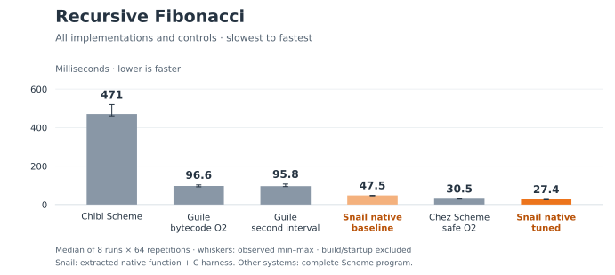
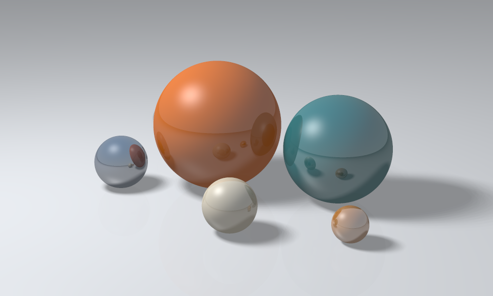

# Benchmarks

**Runtime comparisons exclude compilation and process startup.** The
[compiler benchmark](#compile-the-compiler) measures compilation itself.



The tuned native translator is faster than Chez and Guile on this recursive
Fibonacci workload. Bars show median execution time, ordered slowest to fastest;
whiskers show the observed minimum and maximum. Orange identifies Snail.
See the [generated table](benchmarks/results/2026-10-10-reproduction/summary.md)
and [raw measurements](benchmarks/results/2026-10-10-reproduction/results.json).
This is one call/arithmetic workload, not a claim about every Scheme program.

## Reproduce the comparison

The runners currently require Linux for CPU affinity and process control.

```sh
nix-shell benchmarks/shell.nix
python3 benchmarks/reproduce.py --cpu 2
```

The script builds all implementations, runs the native correctness checks, then
measures eight rotating rounds of 64 repetitions on one CPU. Every run must
produce checksum `269118144`. Omit `--cpu` to use the first CPU allowed by the
host; use `--rounds` and `--repetitions` to change the measurement duration.
It creates a clean worktree at recorded revision `feb1503` under the output
directory: those native Fibonacci tools have since been retired from `main`.
The R7RS and compiler benchmarks below use the current compiler.

Outputs go to `build/benchmark-report/`: `results.json`, `summary.md`,
`comparison.svg`, and `comparison.png`, plus a compact `readme.svg`/`readme.png`
comparing Guile, Chez, and tuned Snail. The full chart includes Chibi, the native
baseline, and the Guile warmup control. JSON includes raw output, preliminary
runs, execution order, commands, tool versions, and source/artifact hashes.
Regenerate the reports without rebuilding or running any workloads:

```sh
python3 benchmarks/reproduce.py --plot build/benchmark-report/results.json
```

### What is timed

- The native translator compiles an extracted Fibonacci function from Wasm to
  LLVM and links it with a C workload harness and BDWGC. The tuned version uses
  static boolean objects and cold, out-of-line numeric fallbacks; integer checks
  remain intact. Both variants execute native code. The build checks numeric
  boundaries, tail calls, collection, and Wasm semantics before timing.
- Chez, Guile, and Chibi execute the complete [Scheme workload](benchmarks/cpu.scm).
  Chez uses safe optimization level 2; Guile is compiled to bytecode with `-O2`.
  Native and Scheme versions perform the same recursive calls and weighted
  checksum, but have different outer harnesses.
- Every sample starts a fresh process. One preliminary run per implementation
  is discarded. The Guile warmup control performs the entire workload twice in
  one process and reports the second interval; both answers are checked.
  Runtime JIT activity remains included. Builds and startup are never timed as
  workload execution.

Absolute times vary with hardware, tool versions, and system load. Compare
implementations within the same run. These results are observations, not CI
performance thresholds.

## Run the R7RS suite

The broader runner uses all 57 workloads from
[ecraven's R7RS benchmarks](https://github.com/ecraven/r7rs-benchmarks), derived
from the Larceny, Gabriel, and Gambit suites. A pinned
[submodule](benchmarks/r7rs-benchmarks) supplies the unchanged benchmark bodies
and correctness predicates. The suite covers allocation, lists, arrays,
strings, IO, numeric computation, and control
flow. Initialize the submodule once:

```sh
git submodule update --init benchmarks/r7rs-benchmarks
```

With Rust/Cargo and the `wasm32-wasip1` target installed, use the same Nix shell:

```sh
export SNAIL_WASM_NATIVE=/path/to/native-translator
python3 benchmarks/r7rs.py --cpu 2
```

The native command must accept `INPUT.wasm -o OUTPUT`; the runner first calls
`build-wasm` from a Scheme build script, then invokes the translator. Default
participants are Snail native, Chez, Guile, and Chibi. Missing tools or an unset
native command produce explicit `unavailable` entries. No substitute backend is
selected.

For a quick harness check while the native command is being configured:

```sh
python3 benchmarks/r7rs.py --systems chez guile chibi \
  --benchmarks fib array1 quicksort --count 1 --rounds 1 --timeout 30
```

`--count` replaces only the upstream iteration count and labels the result as a
**smoke run**. Normal runs keep original inputs. `--timeout` and
`--build-timeout` bound each process, including its descendants. All builds
finish before measurement; successful programs get one discarded preliminary
run followed by rotating measured rounds.

The runner writes JSON, CSV, and a Markdown index under `build/r7rs-report/`,
with a separate SVG/PNG bar chart for each benchmark in `plots/`. Each chart
uses its own zero-based time axis; compare heights within a chart. The index
links every benchmark to its plot.
Every requested cell remains visible, including build errors, incorrect answers,
timeouts, and unavailable implementations. It exits nonzero for failures;
`--allow-failures` permits exploratory runs without changing their recorded
status. Interrupted runs retain incomplete JSON and cannot produce a final plot.
Use `--plot PATH` to regenerate reports from saved data. There is no aggregate
score that silently drops failed benchmarks.

Suite reports stay under `build/`; only the published Fibonacci comparison is
checked in. The full-program native suite is ready to run once its translator
command is available.

### Next showcase: ray tracing

The upstream [`ray` workload](benchmarks/r7rs-benchmarks/src/ray.scm) renders
33 spheres into a 100 × 100 grayscale image. It exercises floating-point math,
vectors, allocation, scene traversal, and image-file output. Original inputs
render the scene 50 times per sample; image writing is part of the timed work.

```sh
python3 benchmarks/r7rs.py --benchmarks ray --cpu 2
```

The runner checks every rendered pixel against the identical output produced
by Chez, Guile, and Chibi; upstream's return-value check alone only verifies
the symbol `ok`. Results include a pixel checksum, the timing chart appears at
`build/r7rs-report/plots/ray.svg`, and each implementation's PGM image is under
`build/r7rs-report/cases/ray/<system>/outputs/ray.output`.

This is the next proposed README comparison, pending Snail execution. The
`(scheme inexact)` library now passes linked-Wasm execution checks. The ray
program next fails on the missing `(scheme read)` library before native
translation; no Snail ray-tracing timing is published. To exercise the
reference engines and image checks now:

```sh
python3 benchmarks/r7rs.py --systems chez guile chibi --benchmarks ray \
  --count 1 --rounds 1
```

### Studio scene



[`studio.scm`](benchmarks/studio.scm) renders colored materials, soft shadows,
and two reflection bounces. The image above is a 960 × 576 Chez reference
render with nine camera rays per pixel and 64 fixed area-light samples.
The scene and sampling are deterministic. Reproduce it with:

```sh
nix-shell benchmarks/shell.nix
python3 benchmarks/render-studio.py --width 960 --samples 3
```

The wrapper writes the actual PPM pixels and a PNG preview under `build/studio/`.
It prints elapsed time including process startup and PPM output, excluding
compilation and PNG conversion. This render took 125.34 seconds on our host
with Chez; that single observation is not an implementation comparison.
Use `--system guile` or `--system chibi` to run the same Scheme program on another
reference implementation; `--width 32 --samples 1` provides a quick check.
This visual showcase is separate from the upstream `ray` timing workload and
has no published Snail timing yet.

## Compile the compiler

[`compile-self.py`](benchmarks/compile-self.py) runs Snail's compiler on its own
full Scheme source and imported libraries. It first freezes the sources and
builds the compiler, then times source parsing, library loading, WAT emission,
and file output. Process startup, building the compiler executable, assembly,
and linking are outside the timer. Every output must match the assembled,
validated Chibi-hosted reference byte for byte.

```sh
export SNAIL_WASM_NATIVE=/path/to/native-translator
python3 benchmarks/compile-self.py --cpu 2
```

The default comparison is Chibi-hosted versus Snail native. To explicitly
exercise the compiled Wasm compiler while the native translator is being
integrated:

```sh
python3 benchmarks/compile-self.py --systems chibi snail-wasm \
  --rounds 3 --output build/compiler-wasm-report
```

Each case gets one discarded preliminary run and rotating fresh-process
samples on one CPU. The runner records commands, source/artifact hashes, raw
times, and failures in `results.json`, and generates `compiler-self.svg`/`.png`.
Native availability never changes a case into a Wasm run. Missing tools,
timeouts, or differing output fail the comparison and remain in the report.
Choose a fresh output directory for each run; `--plot PATH` regenerates charts
from saved JSON. The normal compiler build remains Chibi-hosted.

## Language scope

Snail is not fully R7RS compliant. Reusable, multi-shot continuations are outside
the intended language; the current backend rejects `call/cc` entirely. Single-shot
delimited continuations and coroutines are planned, and other conformance gaps
remain. The Fibonacci comparison does not isolate the cost of continuations.
See [the roadmap](TODO.md) and [backend guide](doc/backend.md).

[The benchmark guide](benchmarks/README.md) retains historical measurements,
other workloads, and compiler-latency results.
