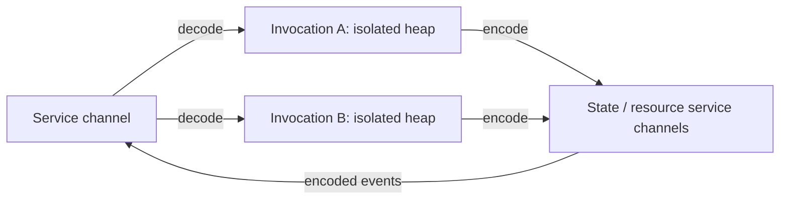

# Application requirements and execution design

**Historical design note.** [Why Snail-Scheme?](why-snail-scheme.md) is the current
design, and the [tutorial coverage map](tutorials/README.md#requirements-coverage)
updates this inventory. In particular, R23's fresh globals per invocation and
R27's fire-and-forget-only interface below were superseded: an actor owns globals
for its lifetime, and a connection can support values, futures, and streams.
The remainder records the earlier candidate discussion, not current contracts.

This is a design synthesis, not an implemented API. It collects the requested
features before choosing abstractions. It revises the earlier assumption that
every application actor has a retained model: ordinary Scheme computation should
be stateless between invocations, with retained state supplied by explicit native
services. Channels connect independently managed computations and resources.
The [candidate comparison](execution-primitives.md) adds the second level: code
examples, operational contracts, and an explicit mechanism for every requirement.

The detailed [execution notes](application-engines.md),
[staging proposal](staged-programs.md), and
[generated-library proposal](generate-library.md) develop particular boundaries.
The [Chibi UI](ui.md) is an existing composition experiment; it does not implement
these isolation, serialization, or service contracts.

## Requirements inventory

These are requirements and use cases from the design discussion. Names and
surface forms remain provisional where the underlying feature is unimplemented.

| ID | Area | Requested behavior |
| --- | --- | --- |
| R01 | Documents | A Pollen/Scribble alternative for documentation, workbooks, and a website; static output and interaction share a composition API. |
| R02 | Markup | A valid structural tree inspired by HTML/XML, ReST, and Pollen; ordinary Scheme literals and full Scheme functions remain available. Reuse `parser.sld`, `syntax-parser.sld`, and located syntax where appropriate. |
| R03 | Reader selection | Explicit Scheme wrappers and source paths. No `#lang`, reader registry, extension dispatch, or interference with shebangs and foreign file syntax. |
| R04 | Generated libraries | `generate-library` has library-like imports and exports and one `begin` containing generator function-body code. Its imports belong to the generator; generated imports are separate; exports describe the generated library. |
| R05 | Reader staging | Generalized syntax transformers and explicit stages. Reading embedded code does not execute it; generation preserves located syntax, hygiene, source-relative paths, and accounted dependencies. |
| R06 | Ordinary Scheme API | Make authoring pleasant without a special reader first. A reader later emits calls to the same functions. |
| R07 | Tree composition | Functional components, elements, and fragments apply beyond the DOM. Prefer simple names such as `element`; avoid implicit UI object identity and lifecycle. |
| R08 | UI updates | Elm-style reducers and explicit messages, rather than `use-state` and hidden hook slots. The model is a value supplied to a function. |
| R09 | Immediate prototype | Run under the available Chibi installation. Keep the reusable library and example application separately readable and provide a working walkthrough. |
| R10 | First presentation backend | HTML and the browser DOM. A custom renderer can follow; the generic composition library should not assume HTML. |
| R11 | Browser computation | Eventually execute Scheme in the browser through Snail's WASM support. The existing server-rendered Chibi demo remains useful but is not client-side Scheme. |
| R12 | One source, several destinations | Author server, browser, and shader code together while compiling distinct payloads with explicit crossings and dependencies. |
| R13 | Typed shader language | A Scheme shader dialect with annotations as needed, producing GLSL/WGSL-equivalent programs or SPIR-V. A shader declaration need not be an ordinary callable Scheme function. |
| R14 | Resin | Port the Python design from Resin's `archive/main-v3`, including generated host/shader buffer layouts and packing, starting with small rendering examples. |
| R15 | Named targets | Describe logical compilation roots and compatible output configurations: browser WASM, native executables/modules, shader payloads, and supporting artifacts. |
| R16 | Vendored applications | Libraries can export composable application/build descriptions containing several targets. Consumers choose configuration, service bindings, and deployment. |
| R17 | Compilers as libraries | Readers, compilers, and builders should be ordinary reusable libraries. Calling one locally does not require an actor boundary. |
| R18 | Relative staging | Syntax expansion, build evaluation, and shipped evaluation remain distinct. Ordinary Scheme evaluation can compose an application, generate code, or construct and compile a JAX-like tensor graph. |
| R19 | Build execution | A baseline build interpreter consumes a Scheme artifact and a build request, producing artifacts and messages through the same execution model used later. |
| R20 | Native control | The native host owns event dispatch and scheduling, following the requested Roc/Win32 host analogy. Scheme supplies exported functions, without requiring an application-owned entry loop or object instance. |
| R21 | Extensible hosting | Bundled native service implementations and user-written Rust/native libraries expose explicit protocols. GUI, browser, server, distributed, and self-hosted/serverless deployments share the communication model. |
| R22 | Runtime and program | Runtime control and application behavior both expose channel protocols. The scheduler still has a native implementation; this does not require an infinite hierarchy of runtimes. |
| R23 | Stateless compute | Separate compute placement and scaling from application state. Invocations use fresh mutable globals and no implicit retained Scheme model or object. |
| R24 | Explicit state services | Ordinary runtime/library functions expose state services. A small set of native implementations owns retained databases, session models, connections, devices, or similar resources. No special persistence semantics for `define`. |
| R25 | Concurrency | Handle messages asynchronously on multiple threads or machines without assuming shared Scheme state. Do not silently serialize an entire service through one application object. |
| R26 | Supervision | Spawn subordinate work easily; observe completion/failure, cancel, set budgets, and choose restart policy. Parent/child ownership and termination rules must be explicit. |
| R27 | Communication | Fire-and-forget channels are the primary interface. Sending has no built-in reply, correlation ID, or wait. Their bindings say which protocol, destination, and resource assumptions apply; callers need not know the placement of an individual worker. |
| R28 | Message types | Dedicated record values; schemas, encoders, and decoders derive from those types. Union metadata can group variants without a second schema or wrapper around every value. |
| R29 | Serialization | S-expressions, never JSON. Every message crossing an actor boundary is encoded and decoded, including local delivery. No Scheme pointer or closure crosses as a message. |
| R30 | Shared resources | Permit explicit database UUIDs, file paths, artifact references, and device resource handles when participants agree on their meaning and access. Isolation does not prohibit shared external resources. |
| R31 | GPU efficiency | Keep textures, buffers, and frames with the renderer/device where possible. Send small serialized commands and resource references; do not re-encode entire resources every frame. |
| R32 | Local addressing | Keep the Scheme heap/object ABI 32-bit. Large weights and data use external storage, explicit 64-bit offsets/ranges, and binary IO/copies. |
| R33 | Temporary memory | Each Scheme isolate owns an isolated bounded heap and resources; retire task memory after output handoff. A frame is a useful task boundary. |
| R34 | GC policy | Choose collection permission and memory budget at spawn. Debug violations trap; release failure or explicitly permitted recovery follows the selected policy. |
| R35 | Allocation proofs | Eventually prove bounds for supported tasks, accounting for implicit allocations and input sizes. A checked budget is useful before such proofs exist. |
| R36 | Hot reload | Rebuild affected artifacts from a shared source, validate candidates, and use them for new work while old work finishes. Native services retain resources; explicit migrations handle persistent schema changes. |
| R37 | Pub/sub | Independent subscriptions are separate logical recipients; workers within one subscription share its work. Publication is fire-and-forget; completion tracking and waiting are optional libraries. |

The [TODO issue](https://github.com/tsnl/snail-scheme/issues/11) tracks implementation
work and links the consolidated platform-design and UI-prototype draft.

## What the requirements share

The recurring operation is to evaluate code with explicit inputs, publish an
owned result or requests, and release temporary resources. A markup reader
produces syntax; a builder produces an application description; a compiler
produces an artifact; a UI reducer produces a proposed model; a frame computation
produces updates and draw requests. Their payload types differ, but each can be
an ordinary function executed within a bounded invocation.

Three separations keep this useful:

1. **Code and invocation.** A library or compiled artifact can be reused for many
   independent invocations. Building code does not create a resident application
   object, and importing a compiler does not deploy a compiler service.
2. **Compute and retained data.** A worker gets the inputs it needs and emits
   results. A state or resource service owns retention, concurrency, and lifetime.
   Model identity need not equal worker identity or code version.
3. **Communication and placement.** A channel promises a particular protocol.
   Its provider decides whether that means a local queue, browser bridge, native
   service, or network connection. It cannot erase requirements for a shared
   database namespace, filesystem, GPU device, ordering, or durability.

Explicit boundaries connect the goals: serialization enforces heap separation;
separate state ownership permits disposable computation; disposable computation
supports bounded memory and replacement of code; exported descriptions make
those computations and their bindings composable through libraries.

Statelessness and purity are separate properties. A handler with no retained
globals can still read a clock or write a database. The preferred pure core takes
all inputs as values and returns computation results and effect requests. Runtime
functions expose those effects through channels; a synchronous effectful wrapper
must identify itself as such rather than claiming to be a pure procedure.

## Construction, execution, and provider protocols

Messages, channels, artifacts, and isolated heaps are useful vocabulary. Listing
them does not yet explain the operations or guarantees an implementation owes.
Separate three kinds of work:

1. **Construction.** Ordinary values, functions, libraries, and explicit
   syntax/staging/type rules describe trees, programs, and build recipes.
2. **Execution.** Invoke code in a fresh bounded isolate; transfer encoded
   messages; own tasks, registrations, and resources across invocation lifetimes.
3. **Provider protocols.** Native services supply state, resources, routing,
   pub/sub, and their particular ordering, transaction, or replay rules.

The [three candidate APIs](execution-primitives.md#candidate-a-direct-endpoints)
show direct endpoints, topics, and pure handlers returning outgoing messages.
They can share the same execution contracts. The
[coverage table](execution-primitives.md#every-requirement-mapped-to-its-mechanism)
identifies the construction or provider work that execution primitives alone do
not supply, including reader hygiene, shader typing, and allocation proofs.

| Concept | Minimal responsibility |
| --- | --- |
| Message | A typed value with a derived S-expression representation. |
| Channel | An endpoint through which a declared protocol admits serialized messages. |
| Artifact | Passive code or data with a format, interface, and dependencies. |
| Isolate | A heap/resource domain with owned temporary memory and an explicit policy. |
| Invocation | One execution of a selected artifact entry, with explicit inputs and bindings. |
| Scope | Native ownership of tasks, registrations, and resources that can outlive individual invocation heaps. |

Use "isolate" for the memory boundary and "invocation" for an execution. The
earlier "microprocess" can remain an informal name for a small disposable isolate.
"Actor" describes a participant exposing message behavior, without requiring an
application object. Our default fresh-invocation policy makes ordinary Scheme
compute stateless across calls; the word isolate alone does not promise that.
A native storage or renderer service deliberately retains state under its protocol.

The default Scheme computation can be described without a retained-state slot:

```text
invoke(artifact-entry, encoded-input, channel-bindings, budget, owning-scope)
    -> encoded outgoing messages and a local execution outcome
```

Execution has temporary stack, heap, and control state. The result does not carry
an implicit next actor model. If later work needs data, put it in a message or
store it through a named service. A bounded multi-message task can retain temporary
execution state until it stops; the default is a fresh invocation for each job.

An application is an ordinary description that composes artifacts, recipes,
channel requirements, and bindings. A target is a named artifact-producing recipe;
it is not an additional execution primitive. A handler artifact can instantiate
isolated invocations. A texture, HTML document, or shader artifact is consumed
by an appropriate service. A shader need not implement a message loop itself.

A contract is the description attached to messages, channels, and artifacts.
It specifies data and behavior; it need not become another runtime object model.
A resource reference is a message value understood by a provider. A supervisor,
database, runtime controller, compiler service, and renderer are protocol
implementations using these same concepts.

## Channels address work, independently of workers

Bind a channel to a service or exported handler. Delivery may start a new
microprocess, select one from a pool, or reach a specific live native service.
Several requests to one stateless service channel may execute concurrently.
A particular task can also have a private reply/control endpoint when needed.
Channel identity therefore does not require one persistent Scheme instance.



Each event carries the data or references needed by another invocation.
Keeping a route open does not keep the previous Scheme heap alive.

Use explicit bindings before adding distributed discovery. A library declares
that it needs a counter-store or renderer protocol; the consuming application
supplies a compatible channel. The binding knows its adapter, endpoint, protocol
version, and resource domain. It can reject an incompatible resource requirement
at setup rather than silently changing the program's meaning.

| Identity | Meaning |
| --- | --- |
| Channel endpoint | Where a particular protocol accepts work. |
| Invocation ID | Which execution attempt is being observed. |
| Scope ID | Which ownership group can be cancelled or released. |
| Job ID, when tracking is chosen | Which higher-level work has an explicit completion condition. |
| Model/resource ID | Which database row, file, buffer, or version the work concerns. |
| Artifact ID/version | Which code or data the invocation uses. |

These may be represented by ordinary records, but they have distinct lifetime
rules. An application must not use an incidental worker ID as its database key.
A serialized channel reference identifies a route within a declared provider or
namespace. A local runtime handle is only a local representation of that binding;
printing its table index is not a portable address. Arbitrary UUIDs do not supply
discovery, authorization, resource access, or a valid route on another machine.

The base channel operation is fire-and-forget: encode a value and hand an owned
frame to the local provider/adapter. Local encoding or queue-capacity failures can
be reported without a response from the recipient. Sending creates no implicit
pending request, correlation ID, reply route, or completion acknowledgement.
Completion tracking and waiting are optional higher-level protocols. A local
handoff does not establish remote delivery or successful processing.

Ordering, capacity, retry, cancellation, and persistence belong to the concrete
channel protocol. A GPU command stream may promise ordered submission; a pool of
independent compilation workers may complete out of order. Do not hide these
differences behind an interface that implies every channel has the same behavior.
Pub/sub should be a standard native service: independent subscriptions each
receive a delivery, while workers serving one subscription compete for its work.
It is an additional delivery contract, not an implication of every channel. The
[topic comparison](execution-primitives.md#topics-kafka-and-the-word-isolate)
distinguishes this from Kafka's retained, partitioned logs and lists membership,
capacity, and lifetime rules that the provider must supply. Request/reply and
waiting can be libraries over ordinary one-way messages when explicitly needed.

## Serialization is unconditional; resources are explicit

For every actor boundary, including two workers on one thread:

```text
record -> derived encoder -> owned S-expression bytes
       -> channel -> decoder/validation -> receiving actor's own values
```

Moving the already encoded byte buffer through a local queue is permitted.
Bypassing encoding with a Scheme object, copying a raw tagged value, or lending
a pointer into the sender's heap is not. The receiver decodes into its own heap;
native services likewise own their decoded request values. No receiver evaluates
incoming S-expressions as code. Closures can exist within an invocation but must
be resolved to data or explicit artifact/entry references before crossing it.

The current tree library permits local component procedures and opaque leaves.
That is useful within one invocation. Before sending a presentation, resolve
components and validate a serializable tree, or render HTML there. General tree
composition does not promise that every value it can hold is a valid message.

The message for a GPU operation can remain small:

```scheme
;; Illustrative data; tags and fields come from declared record types.
(<draw>
  (pipeline (<resource-ref> (provider "gpu-0") (id "pipeline-7") (version 2)))
  (transforms (<resource-ref> (provider "gpu-0") (id "buffer-9") (version 31)))
  (surface (<resource-ref> (provider "gpu-0") (id "surface-1") (version 1))))
```

The textures, transform buffers, and rendered surface remain with their native
provider. If transforms change, those bytes still need to be written, uploaded,
or computed somewhere. Use the explicit binary-resource API for that operation;
the draw message carries its reference. A remote renderer needs accessible data
or an explicit transfer, and sending a video frame remotely still costs a data
transfer. Referencing a resource does not make the resource available everywhere.

Resource protocols can allow shared read access, native shared mappings, or
controlled writes. They specify the namespace/device, ownership, mutation rules,
version, and completion/lifetime conditions. A GPU fence can keep a buffer alive
after the submitting microprocess stops. A filesystem path is valid when both
participants agree on its filesystem namespace. A database UUID is valid under
a bound database service. These are useful agreements, not exceptions to Scheme
heap isolation.

## Stateless handlers with explicit state services

Keep application behavior as ordinary exported procedures. `update(event, model)`
is a useful pure helper: its model is an input value, not a persistent actor field.
A planned handler might produce a versioned proposal:

```scheme
;; API sketch. Event and proposal types are supplied by the application.
(define (handle-step event bindings)
  (let ((next (update (step-event event) (step-model event))))
    (list
     (make-send (binding-ref bindings 'proposals)
                (make-proposal (step-model-id event)
                               (step-version event)
                               next)))))
```

A native model service can load a snapshot, send that input to any suitable
worker, and accept the result only if the expected version still applies. For a
web counter, the flow is: event, snapshot request, isolated computation, conditional
commit, then committed result to the browser. A read followed by an unconditional
write loses updates when two workers increment the same snapshot. Use a service
transaction, compare-and-swap, or a declared per-key sequencer. Stateless compute
allows independent worker scaling; it does not remove coordination over data.

The service may be local memory for a UI, a persistent database on a server, or
another explicitly chosen implementation. Its keyspace and data lifetime are
independent of worker identity. A state service can partition its own storage;
there is no requirement for all retained data to occupy one global managed heap.
Native implementations can themselves scale horizontally under their protocol.

Events can trigger later invocations without preserving the emitting handler's
Scheme heap. Their fields supply the data needed by the next global function.
When an application explicitly chooses completion tracking, a workflow service
can own correlation and continuation data; reply handling and waiting are
higher-level features over one-way messages. A task deliberately kept alive
awaiting messages consumes its reserved resources while waiting.

Publication and commit must have a stated relationship. A pure worker can propose
messages without sending them during computation. Once the runtime admits output,
the corresponding effect may occur. Durable workflows need an explicit service
transaction/outbox and receiver deduplication if they retry. Ordinary channels
do not promise an atomic commit across recipients or exactly-once external work.

## Supervision and native runtime control

Expose runtime control as a native service protocol: start compatible code with
input, bindings, and a budget; report completion/failure; cancel; replace a service
binding with a compatible artifact version. Starting a microprocess need not start
an OS process. Code and empty arenas may be pooled while each invocation gets
fresh mutable Scheme memory and initialization.

A supervisor uses this protocol for subordinate jobs. Keep its child registry,
limits, and restart bookkeeping in the native runtime service or an explicit
state service; Scheme policy functions can remain stateless. A supervised job's
lifetime can span several short invocations: returning from the parent handler
releases its heap without necessarily ending the native job/cancellation scope.
When that scope ends, cancel subordinate jobs unless they were explicitly detached.
Specify who owns each output and resource after termination. A failed parent is
not evidence that a child or an external write did not finish. Retrying pure computation and
retrying already published effects need different policies.

Runtime control and application handlers thus share a message interface. The
kernel still implements scheduling, memory protection/ownership, serialization,
and physical IO. Those instructions do not each require their own actor exchange.
Likewise, a compiler library can run as an ordinary local call inside a worker;
put it behind a channel when independent scheduling or isolation is useful.

## Stages, targets, and reload use the same boundary

A build request selects a Scheme artifact and invokes its exported builder. The
builder calls libraries to compose descriptions, generate syntax, or construct a
typed graph. It can call a compiler library locally or request a compilation job
through a channel. Completed artifacts become explicit inputs to later services
or invocations. Build orchestration state belongs to an explicit native job
service/workflow record when it must survive several invocations.

`generate-library` and syntax transformers define source-language boundaries;
they do not require separate runtime kinds. A shader compiler checks a typed IR
even if ordinary Scheme assembled it dynamically. Artifacts retain formats and
interfaces, so a WASM module, ELF executable, shader, and texture are not treated
as interchangeable executable programs.

Reload changes the artifact bound to new work after validation. Existing work
keeps the artifact version it started with until completion or explicit
cancellation. External state/resources stay with their providers. Schema changes
need explicit migration or compatibility; pending replies and old client code
may still use the previous message types. Compatible shaders can replace a
pipeline while textures and buffers remain owned by the renderer. A failed build
keeps the previous binding usable.

## Boundaries worth testing before adding more language forms

1. Derive a record codec and run two local deliveries through actual encode/decode,
   rejecting unsupported values and proving sender mutations cannot affect receipt.
2. Run the same stateless handler for independent messages on multiple workers,
   each with a separate heap. A fresh Chibi subprocess can demonstrate separation
   initially; an in-process Chibi callback alone does not establish separate heaps.
3. Put the counter model behind an explicit service. Race two updates to expose
   and then check the chosen conditional-commit protocol. Separate browser/server
   channels from model identity and worker identity.
4. Spawn a child, observe its failure, cancel it, and replace its code without
   preserving a Scheme object. Check queue limits and output ownership at teardown.
5. Render with an external buffer reference and measure serialization, resource
   upload, allocation, and teardown separately. A no-GC frame still pays those costs.
6. Run a library-based build and a client/server application through the same
   invocation boundary. Add reader/shader staging after the basic crossings work.

The [memory policies](application-engines.md#collection-policy-is-part-of-spawning)
and [allocation proof scope](application-engines.md#proving-a-task-fits-its-region)
remain applicable. Serialization, decode, initialization, and output publication
must all be covered by the chosen budgets; a tiny computation alone does not
establish a bounded invocation.

## Precedents and limits of the analogy

The earlier reference was [celld](https://celld.dev/docs/). It explicitly describes
stateful cells with private databases and single ownership; external storage
lets them be deactivated and relocated. Its
[ownership and durability protocol](https://celld.dev/docs/guarantees/) relies on
conditional writes, fencing, and acknowledgement rules. The proposed stateless
Scheme worker is a deliberate further separation of computation from that state.

[Cassandra's architecture](https://cassandra.apache.org/doc/latest/cassandra/architecture/dynamo.html)
routes requests through coordinators to stateful replicas with declared consistency
requirements. It is useful as a data-service precedent, not evidence that storage
coordination disappears. In Snail, ordinary computation should not have to become
a resident data owner merely to use such a service.
