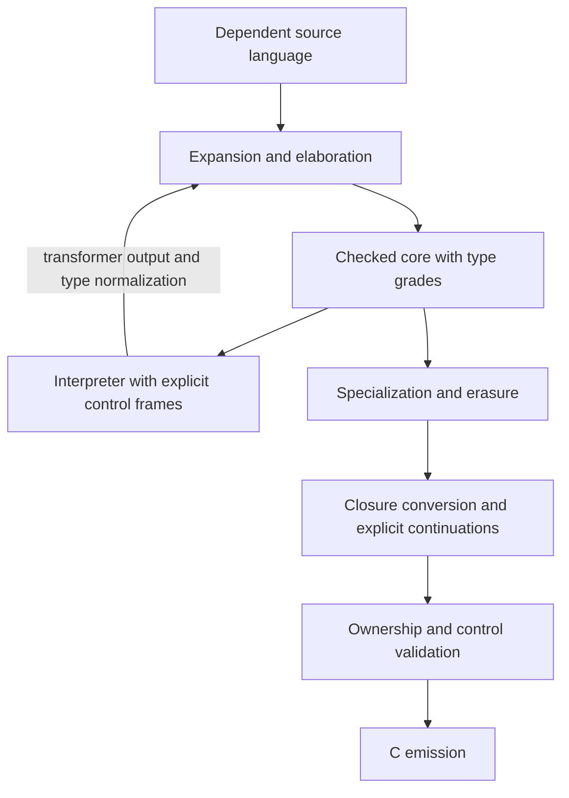

# A typed, graded core for Snail-Scheme

Status: design sketch, not an implemented language or a complete calculus.
The earlier Esker drafts were not available when writing this document.

The first implementation targets a parser, elaborator, typechecker, and
tree-walking interpreter for the immutable subset. Shared mutation and cyclic
storage are **WIP** and outside that initial subset. C generation and full
Scheme lowering remain later goals.

The [minimal grammar and macro expansion proposal](core-grammar.md) scopes the
parser-facing forms, their binding rules, and a later `syntax-rules` engine
implemented with immutable core data and functions.

The proposal is a strict dependently typed language with unions, owned values,
and specialization. Types are values, and `def` is the only top-level
binding form. `struct` and `Π` construct type values; `λ` constructs
functions. Ownership grades are `1` and `omega` and belong to types. A user
can specify a grade only in a `struct` expression, restricting the grade
inferred from its fields.

`Π` and `λ` each require an implicit binder group followed by an explicit
binder group, even when either is empty. Implicit-only parameters are inferred
from the supplied explicit arguments. By convention, write the implicit group in square
brackets; bracket style has no semantic meaning. A parameter never switches
between implicit and explicit at a call site. Both forms require `→` followed
by an explicit result type after the binders; `λ` then adds `=` followed by a
body expression. Every `λ` starts with a mandatory `#:captures (...)` clause
naming its captured outer bindings, including `#:captures ()` when there are none.

A small interpreter executes checked terms, including compile-time programs.
A compiler specializes the same language and eventually emits C. The first
programs should exercise this language directly; `(scheme base)` comes later.

### Identifier spelling

Use `lower-kebab-case` for ordinary identifiers, including word-based forms, type
values, type families, functions, fields, and explicitly supplied parameters:
`def`, `type`, `i64`, `array`, `make-pair`, and `value-type` follow the
same rule. A type value does not get a capitalized name merely because it is a
type.

Reserve `Upper-Kebab-Case` for metavariables: the implicit-only parameters
solved from explicit arguments, and schematic variables in the typing rules.
Examples include `Element-Type`, `M`, and `N`. An explicitly supplied parameter
of type `type` is still an ordinary lower-case name. Capitalization identifies
this syntactic role; it does not change grades, erasure, or evaluation phase.

The symbolic forms `λ` and `Π`, markers `→` and `=`, and operator `+` are
separate from the identifier-casing convention. Use these Unicode spellings
for the function forms and arrow throughout the language sketch.
Use word-based names for ordinary predicates and conversions, such as `is-i64`
and `scalar-to-integer`. References to existing Scheme or other languages keep
those languages' own spelling.

## 1. One binding form, type values, and dependent functions

Every top-level binding has the same shape:

```text
(def Name Expression)
```

There is no separate type declaration, universal-quantification declaration, or
standalone top-level type-specifier form. Whether `name` denotes a type, a type
family, a function, or an ordinary value follows from its expression.

```scheme
(def point
  (struct ((x i64) (y i64))))

(def scalar
  (union i64 boolean))

(def id
  (λ #:captures () [(Element-Type type)] ((x Element-Type))
    → Element-Type
    = x))

(def id-type
  (Π [(Element-Type type)] ((x Element-Type))
    → Element-Type))

(def increment
  (λ #:captures () [] ((x i64))
    → i64
    = (i64-add x 1)))
```

A binder is `(Name Type-Expression)`, in both `Π` and `λ`. There is no
binder grade or type-separator token. The forms are:

```text
(Π [Implicit-Binder ...] (Explicit-Binder ...) → Result-Type)
(λ #:captures (Capture-Name ...) [Implicit-Binder ...] (Explicit-Binder ...) → Result-Type = Body)
```

Each `Implicit-Binder` or `Explicit-Binder` stands for `(Name Type-Expression)`.
Both parameter groups are mandatory: the first is implicit and the second is
explicit. Write `[]` when there are no implicit parameters and `()` when there
are no explicit parameters. A lambda with no captures and no parameters has
the header `(λ #:captures () [] () → Result-Type = Body)`.

The capture clause is separate from the parameter groups and never appears on
`Π`. Capture names resolve in the enclosing scope; their types are known from
those bindings. Captured bindings are in scope in the parameter annotations,
result type, and body. The ownership and completeness rules are in section 6.

The reader accepts matching `(...)`, `[...]`, and `{...}` interchangeably as
list delimiters and rejects mismatched pairs. Square brackets for the implicit
group are a writing convention only. For example, `[(T type)]` and
`((T type))` mean the same thing in that position. Position, rather than
delimiter shape, determines parameter roles. Calls still supply only explicit
arguments; this convention does not introduce an implicit-argument call form.

Both forms require the `→` marker; a `λ` also requires `=`. These are syntax
markers, not expressions to evaluate. They visually separate the parameter
groups, result type, and body.

The result type is mandatory on every λ, including anonymous functions
and functions that return types. All parameters are in scope in that type
and in the body. Use a single body expression, nesting `let` when sequencing
is needed; `begin` can be derived later. A nondependent function type is just a
`Π` whose result does not mention its arguments.

The checker derives `id`'s call signature as `id-type` directly from the λ
header. It verifies that the declared result expression denotes a type, then
checks the body against that type; it does not infer a missing return type.
The type expression follows the pure normalization rules used elsewhere in
type checking, rather than executing arbitrary effects or consuming owners.
At a call, substitute the inferred and supplied arguments into the result
type, preserving symbolic dependencies when values are not statically known.

Local `let` bindings and implicit call arguments can still infer their types
and values. An expression ascription such as `(ann e Element-Type)` remains
available where needed. For recursive definitions, the complete λ header
supplies the call signature before checking recursive calls; a separate
top-level declaration is unnecessary.

### Local bindings and sequencing

`(let ((Name Initializer) ...) Body)` evaluates its initializers from left to
right in the outer scope, then evaluates its single body expression with all
new bindings in scope. Initializers in the same `let` cannot refer to one
another's new bindings. Each binding infers its type from its initializer.

Nest `let` expressions when a later computation depends on an earlier result:

```scheme
(def increment-twice
  (λ #:captures () [] ((x i64))
    → i64
    = (let ((first-step (i64-add x 1)))
        (let ((second-step (i64-add first-step 1)))
          second-step))))
```

The outer initializer runs first. Its `first-step` binding is available to the
inner initializer, and the inner body's value is the result of the whole
expression. A body's final expression retains tail position.

An initializer may be evaluated even when its binding is unused. Unused affine
owners receive the usual cleanup at scope exit; a `let` does not imply that its
bound value is discarded before evaluating the body. Explicit consumption can
end ownership earlier. Lambda and `let` bodies each contain exactly one
expression, with nesting expressing sequential work.

### Telescopes and scope

Parameter lists and struct field lists are **telescopes**: ordered sequences
of typed binders in which later types may refer to earlier values. This follows
the usual [telescope terminology](https://agda.readthedocs.io/en/stable/language/telescopes.html).
A new binder enters scope after its own type annotation, and remains in scope
through the rest of the telescope. There are no forward references to later
binders.

For `Π` and `λ`, read the implicit group followed by the explicit group as
one telescope. Earlier implicit parameters can appear in later implicit or
explicit parameter types; earlier explicit parameters can appear in later
explicit parameter types. All parameters are in scope in the result type and,
for `λ`, the body. Either group may be empty under the syntax rules above.

This scope order does not restrict the direction of inference: a later
explicit argument may determine an earlier implicit parameter. The parameter's
declaration still cannot refer forward to that argument's binder. Dependency
also does not imply erasure or permission to consume an owner during checking;
the phase and ownership restrictions below still apply.

Dependent result types can refer to explicit arguments:

```scheme
(def array-result-type
  (Π [(Element-Type type)] ((x i64) (y i64) (seed Element-Type))
    → (result (array Element-Type (+ x y)) array-error)))
```

The lengths use the ordinary `i64` type. With `(x Element-Type)` and
`(y Element-Type)` for arbitrary `Element-Type`, addition is not established.
Signed integers also require validity and overflow checks before they can
describe an allocated array; the `result` exposes that failure path.
`array-error` represents the array library's size and allocation errors, and
`result` is the union family defined below. The extra `seed` parameter lets a
call infer the otherwise unconstrained `Element-Type` ; this is only an
interface example, not an implementation that duplicates an arbitrary seed
into an array.

A more useful dependent interface is concatenation:

```scheme
(def array-append-type
  (Π [(Element-Type type) (M i64) (N i64)]
      ((xs (array Element-Type M)) (ys (array Element-Type N)))
    → (result (array Element-Type (+ M N)) array-error)))
```

Here explicit arrays determine `Element-Type`, `M`, and `N`. The successful
result type records the sum without requiring either input array to be
evaluated during type checking. Concatenation checks that the sum and
allocation size are representable before constructing that result.

A λ uses the same dependent result syntax. For example, preserving an
array also preserves its element type and length:

```scheme
(def keep-array
  (λ #:captures () [(Element-Type type) (N i64)] ((xs (array Element-Type N)))
    → (array Element-Type N)
    = xs))
```

The declared result is a type expression in the arguments' scope. More complex
expressions such as `(array Element-Type (+ M N))` are equally valid when the
checker can establish that the body returns a value of that type. This does
not enable inferring implicit parameters from an expected result at a call
site.

### Integer types and array lengths

Use fixed-width integer types such as `i32` and `i64`; there is no separate
natural-number type in the core. Both are unrestricted. Use `i64` for the
array family's logical length index, with explicit conversion when crossing
to a different integer representation. A backend must also check its own
address-space and allocation limits.

Type-level integer arithmetic has exactly the same semantics as runtime
arithmetic. In these examples, `+` on `i64` denotes wrapping addition, as does
`i64-add`; constant folding uses the same width and signed interpretation.
There is no hidden unbounded arithmetic for type indices. In particular,
adding one does not always increase an index.

Array construction checks nonnegativity, representation limits, and allocation
size. Treat `(array Element-Type N)` as a well-formed indexed type for any
`i64` index, but give invalid lengths no array inhabitants. A failing checked
constructor returns an error, whether the bad length is constant or discovered
at runtime. An existing array therefore witnesses that its own length is
valid; simply forming a type expression does not perform an allocation or
prove its success.

Concatenation must check addition for overflow before accepting a new length;
it cannot use a wrapped sum to allocate an undersized buffer. On success, the
checked mathematical sum fits `i64` and agrees with the wrapping expression
`(+ M N)` in the result type. Checked byte-size multiplication and allocation
may still fail, so the interface returns `result`.

### Implicit-only and explicit-only parameters

The implicit group is never an alternative calling convention. For `id`,
`(id v)` is the invocation form: the checker determines `Element-Type` from
`v`'s type. There is no `(inst id i64)`, named implicit override, or call
form supplying the implicit group.

```scheme
(def example-integer
  (id (ann 42 i64)))

(def example-boolean
  (id #t))
```

The annotation on `42` checks an explicit argument. It does not supply
`Element-Type` directly. An expected result type may check the completed
application, but it must not fill in an implicit that the explicit arguments
did not determine. For a type family or constructor with no suitable arguments
to infer from, put the relevant type parameter in the explicit group when
defining it.

For example, the type family `pair` below takes its type arguments explicitly,
whereas its value constructor `make-pair` infers them:

```scheme
(def pair
  (λ #:captures () [] ((first-type type) (second-type type))
    → type
    = (struct ((first first-type) (second second-type)))))

(def make-pair
  (λ #:captures () [(A type) (B type)] ((x A) (y B))
    → (pair A B)
    = (new (pair A B) ((first x) (second y)))))

(def example-pair
  (make-pair (id (ann 42 i64)) (id #t)))
```

`new` is proposed expression syntax for constructing a value of a struct type.
It checks fields against that type; it introduces no top-level names. `pair`
is called as `(pair i64 boolean)` because both of its parameters are
explicitly supplied. The type arguments of `make-pair` cannot be supplied that
way, because its parameter roles are fixed differently.

During checking, replace implicit parameters with metavariables and solve them
from explicit arguments and their dependent parameter types. Later explicit
arguments may solve constraints left by earlier ones. Begin with first-order
and dependent-pattern unification plus normalization, not arbitrary equation
solving. If inference leaves a parameter ambiguous, reject the invocation.
Making that parameter explicit is a change to the definition's interface.

Implicitness is independent of erasure and compile-time availability. An
explicit parameter can be a type value; an inferred integer parameter
might still be used at runtime. The parameter groups specify how arguments are
provided, not an additional grade system.

## 2. Structs are type-forming expressions

Evaluating a `struct` expression produces a type value. It does not also bind
a constructor, predicate, or field accessor in the surrounding scope. Such
operations can be ordinary explicitly defined values, or generic primitives
like `new` and consuming pattern matching.

A type family is an ordinary function returning a type:

```scheme
(def none
  (struct ()))

(def some
  (λ #:captures () [] ((value-type type))
    → type
    = (struct ((value value-type)))))

(def option
  (λ #:captures () [] ((value-type type))
    → type
    = (union none (some value-type))))

(def ok
  (λ #:captures () [] ((value-type type))
    → type
    = (struct ((value value-type)))))

(def err
  (λ #:captures () [] ((error-type type))
    → type
    = (struct ((error error-type)))))

(def result
  (λ #:captures () [] ((value-type type) (error-type type))
    → type
    = (union (ok value-type) (err error-type))))
```

The type-forming functions use explicit-only parameters so `(option i64)` and
`(result i64 error)` are ordinary applications. A value-construction helper
can instead infer a type parameter from the value it receives, just as
`make-pair` does. A constructor for an empty container cannot infer an element
type from no arguments: its interface needs an explicit type argument or
another explicit argument carrying that information.

Preserve nominal identity without making type normalization generative.
Propose a stable identity for each `struct` expression, parameterized by its
surrounding type-family arguments. Re-evaluating the same application yields
the same type; evaluating two distinct struct expressions can yield distinct
types even if their field layouts agree. Thus `(some i64)` is reproducible,
while an independently defined wrapper is a different type. Binding an alias
to an existing type value preserves its identity.

The exact identity keys need formalization before implementing macros and
cross-module serialization. Allocating a fresh nominal identity on every
normalization step would make type equality unstable and is not the proposal.

### Dependent fields and dependent pairs

Struct fields use the same telescope scoping rule as function parameters:

```scheme
(def sized-array
  (struct ((length i64)
           (items (array i64 length)))))
```

Here `length` is a field value in scope in the type of `items`. A value of
`sized-array` packages a length together with an array of that length; the
length need not be known at compile time. `new` checks fields in declaration
order, substituting earlier checked field values into later field types and
retaining symbolic dependencies where necessary. An inconsistent length and
array are rejected; forming the record type does not allocate an array.

Consuming pattern matching opens the field telescope in the same order, so
the extracted array keeps its dependency on the extracted length. It transfers
ownership of the fields without retaining a second owner of the record.
Initially permit dependencies on immutable, unrestricted runtime indices such
as `i64`, alongside the existing static type parameters. Type checking must
not consume an earlier affine field or run its effects to determine a later
field's type. More general dependencies need additional rules.

Keep `struct` as the nominal type former and the site of user-written grade
restrictions. Telescopes add dependency without making distinct struct
definitions interchangeable. Dependent pairs, or Σ-types, can be expressed as
an ordinary library family using a two-field telescope whose second field's
type depends on the first. Such a family must satisfy the same dependency and
grade constraints as other structs. It needs no separate primitive type former;
`Σ` notation can be added later. As a precedent,
[Agda's built-in Σ](https://github.com/agda/agda/blob/master/src/data/lib/prim/Agda/Builtin/Sigma.agda)
is itself defined as a record.

## 3. Unions and refinement

Keep the set-like unions and branch refinement that motivated the Typed Racket
starting point. Union formation itself is an expression producing a type value.
The minimal grammar gives `union` an intrinsic n-ary form; the initial fixed-arity
`Π` does not make it an ordinary first-class variadic function.

```scheme
(def maybe
  (λ #:captures () [] ((value-type type))
    → type
    = (union (singleton #f) value-type)))

(def scalar-to-integer
  (λ #:captures () [] ((x scalar))
    → i64
    = (match x
        ((is i64 integer) integer)
        (#t (ann 1 i64))
        (#f (ann 0 i64)))))
```

`#f` is a Boolean value; `(singleton #f)` is the type value containing only
that Boolean. This explicit formation keeps `union` an operation on type values
instead of contextually changing the meaning of its arguments. `(maybe boolean)`
cannot distinguish absence from a present `#f`; `option` supplies distinct
nominal variants when that distinction matters.

The `is` pattern binds the selected integer as `integer`; the other clauses
handle the two Boolean values. Members are subtypes of their union. Flatten nested unions, ignore
member order, remove duplicates, and remove members already covered by another
member. These remain the intended union semantics, following
[Typed Racket's discussion of unions and subtyping](https://docs.racket-lang.org/ts-guide/types.html)
.

Overlapping members denote shared sets of values. Clauses are tried in order;
after a failed pattern test, later clauses exclude the values it would accept,
rather than blindly removing one syntactic member. Start with primitive tags,
supported singletons, and nominal-struct patterns. User-defined refinement
propositions can come later, following the direction
of
[occurrence typing](https://docs.racket-lang.org/ts-guide/occurrence-typing.html)
.

Refinement never creates a second owner. `match` evaluates its scrutinee once
and uses safe tag observations to select a clause before moving the selected
value or fields into that branch. These tests expose no reference and retain
nothing. An arbitrary function call still transfers ownership as required by
its argument's type. Consuming an affine scrutinee makes its original owner
unavailable; only the chosen pattern's bindings own the selected payload.

`match` is the core branching form. A higher-level Boolean conditional
`(if Test Yes No)` lowers to `(match (ann Test boolean) (#t Yes) (#f No))`.
Both branch bodies must typecheck, and only the selected body executes. The
ascription preserves the Boolean-test requirement without another core form.

## 4. Grades are properties of types

Write `grade-of(Element-Type)` for the effective grade of the values
inhabiting type `Element-Type` :

| Grade | Meaning |
| --- | --- |
| `1` | Affine ownership: may be moved or consumed at most once |
| `omega` | Unrestricted: may be duplicated and discarded safely |

The permission order is `1 < omega`, not an automatic subtyping rule.
Changing a name or annotation cannot grant a value greater permissions.
Grade `1` permits abandonment and cleanup; it does not enforce exactly-once
protocols. Safe tag observations do not count as ownership transfers.

Ownership describes duplication permissions; phase availability and erasure
are separate concerns. The same type can describe a runtime value, a value used
during compilation, or a value whose representation is erased.

### Structs can only restrict their fields' grade

```text
Field-Grade = min(grade-of(Field-Type-1), ..., grade-of(Field-Type-N))
min of no fields = omega

no annotation:  grade-of(Struct-Type) = Field-Grade
#:grade Grade:  require Grade <= Field-Grade; grade-of(Struct-Type) = Grade
```

For dependent fields, check this bound in the context of the field telescope.
At a fixed type-family application, the inferred grade must be safe for every
admitted value of the preceding fields. If a dependent payload can be affine,
the package cannot be unrestricted. Retain formulas or constraints involving
static family arguments; do not choose the package's grade by assuming a
favorable runtime index. An explicit grade restriction must meet the same
bound for all admitted field values.

The only user-written grade annotation occurs in a `struct` expression:

```scheme
(def ticket
  (struct ((number i64)) #:grade 1))

(def envelope
  (struct ((ticket ticket) (label i64))))
; grade-of(envelope) = 1.

(def bad-envelope
  (struct ((ticket ticket)) #:grade omega))
; Rejected: omega exceeds the field grade of 1.

(def empty-token
  (struct () #:grade 1))
```

`ticket` restricts a shareable payload to an affine wrapper. Consuming the
wrapper can recover an unrestricted integer, but cannot leave a second `ticket`.
`point`, defined earlier, has grade `omega` from its integer fields.

Retain grade formulas for parameterized types:

```text
grade-of(some A)     = grade-of(A)
grade-of(pair A B)   = min(grade-of(A), grade-of(B))
grade-of(result A E) = min(grade-of(A), grade-of(E))
grade-of(union A B)  = min(grade-of(A), grade-of(B))
grade-of(option A)   = grade-of(A)
```

An explicit struct grade must be valid for every admitted instantiation.
Restricting a generic wrapper to grade `1` is always permitted by the ownership
order: every field grade is `1` or `omega`. Declaring `omega` requires all fields
to be unrestricted. Do not silently add that premise to the type of a
supposedly unconstrained family. The syntax for such constraints remains an
open part of the dependent interface design. Runtime representation eligibility
is checked separately from ownership.

A union cannot be duplicated if any possible variant is affine. After a sound
refinement establishes that a live `(union ticket i64)` is specifically an
integer, that branch can duplicate it. The `ticket` branch still owns one
`ticket`. Consumed values cannot be recovered by subsequent refinement.

For recursive data, solve grade equations together from `omega`, propagating
restrictions to their greatest fixed point and checking declared grades.
Normalization must preserve nominal wrapper restrictions. Define `nothing`
as the empty union; its grade can be `omega` vacuously because it has no values.

### Type values, erasure, and phases

Distinguish the type value `ticket` from a value inhabiting it.
`grade-of(ticket) = 1` restricts `ticket` instances, not the number of times
the checker can mention that type. The checker can reuse type descriptions
while forming other types.

For the initial staged implementation, type values are erased from the target
program unless explicitly reified by a future runtime-descriptor facility.
Treat `type` as a universe and maintain levels internally: `type` must not be
its own type. Whether an expression denotes a type is determined by checking
its type against the appropriate universe.

Erasure does not require every erased value to be known during compilation:
the checker may reason about an index symbolically without retaining an
additional runtime argument for it. Conversely, an inferred argument may be
needed at runtime. Implicitness alone grants no permission to erase it.

Erasure must preserve required evaluation and cleanup of live resources.
Ordinary ownership rules still apply when values execute at either phase.
Type parameters and phantom indices are not automatically stored fields;
their presence in an annotation does not lower a container's ownership grade.
Explicit relevance annotations remain a separate future design.

## 5. Ownership, containers, and sharing

Passing, returning, or storing an affine value transfers ownership. Uses on
exclusive branches are checked per path; sequential uses accumulate. Clean up
unused owners on scope exit and abandoned control paths.

```scheme
(def bad-copy
  (λ #:captures () [] ((value ticket))
    → (pair ticket ticket)
    = (make-pair value value)))
; Rejected: two ownership transfers from one ticket.

(def copy-integer
  (λ #:captures () [] ((n i64))
    → (pair i64 i64)
    = (make-pair n n)))
; Accepted: grade-of(i64) = omega.
```

`share Element-Type` means `grade-of(Element-Type) = omega`. It is a
constraint, not a customizable instance that can override a struct's grade. A
generic duplication function needs that premise; accepting an unconstrained
type parameter `Element-Type` does not establish it.

The proposed owned `vec A` is affine for runtime elements, with exclusive
updates that return the resulting owner deferred beyond the immutable subset.
An immutable `list-of A` can inherit `grade-of(A)`, with shared storage when
that grade is `omega`. Indexing and
conversions have checked failures. Arithmetic has defined wrapping or checked
behavior instead of inheriting C undefined behavior.

`arc A` is a trusted shared-handle constructor, unrestricted for runtime
payloads even when `A` is affine. Duplicating a handle does not duplicate its
payload. This is a runtime abstraction, not permission for a user struct to
raise the grade of an inline field.

The primitive call signatures can be described by ordinary type values:

```scheme
(def arc-new-type
  (Π [(A type)] ((value A))
    → (arc A)))

(def arc-try-unwrap-type
  (Π [(A type)] ((handle (arc A)))
    → (result A (arc A))))
```

These runtime interfaces require runtime-eligible payloads; formalizing their
constraints is part of the grade-checking work. Reading out a copy additionally
requires `share A`. Unique extraction can return an affine payload only when
no other handle remains, returning the handle on failure. In particular,
sharing `arc ticket` or `arc (cont-1 A)` cannot create duplicate payload owners.

This adopts handle sharing and unique extraction from
[Rust's Arc](https://doc.rust-lang.org/std/sync/struct.Arc.html) without
exposing borrowed references. Initially exclude user-constructible reference
cycles and shared mutation. General cyclic Scheme objects need a later
collection strategy.

### WIP: shared mutation and cyclic storage

Shared mutation is a future extension, not part of the initial implementation
target. Keep ordinary bindings and struct fields immutable. A candidate
extension is a managed `(cell A)` handle with explicit allocation, read, and
write operations; their interfaces and effect rules remain to be specified.

For a first cell design, require `grade-of(A) = omega` and give the handle
grade `omega`. Duplicating a handle would share the same location. Reading
would return a value of `A`; writing would replace the stored value while
preserving its type. Neither operation would expose a borrowed reference.
This would be a trusted runtime abstraction, with no new user-written grade
annotation site.

Types and refinements could depend on stable immutable snapshots, but could
not assume that a cell retains its contents across reads. Cell operations
would be effects excluded from type normalization. A cell containing a
dependent record would replace the whole record so its field dependencies
remain valid.

Scheme lowering could use cells containing an unrestricted `scheme-value`
representation. That representation must preserve ownership when exposing
core resources; it cannot make an affine payload freely duplicable. Shared
mutation also permits cyclic object graphs. Plain reference counting does
not reclaim strong cycles, so cyclic storage needs a collection strategy.
The cell API, effect rules, and collection strategy are WIP; they do not block
implementing and exercising the immutable core.

## 6. Functions, inference, and specialization

### Explicit consuming captures

Every lambda declares its captures with `#:captures (Name ...)`. The clause
contains distinct names of enclosing bindings, not arbitrary expressions.
Resolve these names before introducing the lambda's parameters. Reject duplicate
capture identities and capture/parameter name collisions.

```scheme
(def make-adder
  (λ #:captures () [] ((offset i64))
    → (Π [] ((x i64)) → i64)
    = (λ #:captures (offset) [] ((x i64))
        → i64
        = (i64-add x offset))))

(def retain-ticket
  (λ #:captures () [] ((value ticket))
    → (Π [] () → ticket)
    = (λ #:captures (value) [] ()
        → ticket
        = value)))
```

Constructing a closure acquires its listed captures in order. Each affine
capture moves into the closure immediately, making the outer binding unavailable
even if the closure is never called. An unrestricted capture may be copied, so
the outer binding remains usable. The body owns the captured fields when the
closure is invoked; capturing a value does not relax its usage rules.

The capture list covers free enclosing bindings throughout the lambda: parameter
annotations, the result type, the body, and nested lambdas' capture clauses.
It also covers local dependencies in captured values' types. For example, a
captured `xs` of type `(array i64 n)` requires the enclosing `n` to be listed
as well. Type-only dependencies obey the phase rules and can be erased; they
cannot silently supply a hidden runtime value or consume an affine owner during
checking. Initial type dependencies remain limited to immutable unrestricted
indices and static type parameters.

Primitive bindings and verified closed static top-level definitions can be
referenced directly without occupying the capture environment. Every other
outer value, including a runtime top-level value, must be listed. A local
binding requires explicit capture even if optimization can compute its value.
A recursive function's self reference is a special body-only binding, not a
capture or a header dependency. Initially recursive environments must be
unrestricted; recursive calls cannot recreate affine captured owners.

A closure is a compiler-generated struct containing its captured runtime values
and a code reference. Its concrete grade follows those fields: a captured
`ticket` or continuation makes it affine; an unrestricted environment permits
reuse. An empty runtime environment has grade `omega`. Eliminating a field during
optimization must preserve established ownership restrictions and required
cleanup. There is no user-written closure-grade annotation.

### Call signatures and specialization

A `Π` describes a call signature, including implicit and explicit parameters and
result dependencies. It does not reveal a hidden closure environment's grade.
Initially treat an environment-erased callable with a given `Π` signature as
affine, since its possible runtime environments have grades `1` or `omega`.
A concrete top-level function item can remain reusable because its empty
environment is known. Runtime top-level values require explicit captures,
including unrestricted ones; a top-level lambda is not automatically capture-free.
Interfaces must preserve that distinction rather than
silently asserting that every function with the same `Π` can be duplicated.
A later generic callable constraint can retain the concrete environment type
when reuse matters.

Polymorphism is ordinary abstraction over type values, without a separate
universal-quantification form. The implicit group on `id` expresses its
polymorphism; the explicit group on `pair` expresses a type-forming function's
arguments. A convenience elaborator can infer suitable local polymorphism, but
it must translate to this same explicit representation and respect parameter
roles. Never re-create one captured affine environment for each instantiation.

Infer local types with checking and synthesis; solve omitted implicit values
from explicit arguments. Dependent conversion compares normalized type terms.
Union-aware checking also requires subtyping and refinement; it is not plain
Hindley-Milner unification. Inferable interfaces need not admit complete
inference for arbitrary type-level computation.

Specialize reachable code at known representation-relevant type arguments,
cache instances, and diagnose unbounded specialization growth. An implicit
argument is not automatically a specialization key: a symbolic length index
may use uniform array storage, while a concrete element type selects layout.
Likewise, an explicit type argument can be fully static and erased.

First-class type formation does not guarantee that every runtime-computed type
has a statically known C layout. The backend must either have a uniform
representation for a checked term or diagnose that its current representation
strategy cannot compile it. That restriction should be distinguished from
logical type correctness.

## 7. One-shot continuations own their future

`cont-1 A` is an affine primitive type. Its ownership rules do not depend on how
a binder was written. Start with ownership-transferring capture rather than
ordinary Scheme `call/cc`:

```scheme
(def capture-1-type
  (Π [(A type)]
      ((body (Π [] ((k (cont-1 A))) → nothing)))
    → A))

(def invoke-1-type
  (Π [(A type)] ((k (cont-1 A)) (value A))
    → nothing))

(def answer
  (i64-add 1
    (capture-1
      (λ #:captures () [] ((k (cont-1 i64)))
        → nothing
        = (invoke-1 k 41)))))
; Produces 42.
```

The explicit callback annotation determines `capture-1`'s implicit `A`.
`nothing` means the callback cannot return normally. Both primitives have a
control effect, and capture propagates the callback's effects; these examples
show call signatures, not a claim of purity.

Capture moves the current continuation into a fresh handle and runs the
callback without that continuation as its normal return path. Invocation
consumes the handle, releases abandoned invoking frames, and resumes the
saved future. The callback and saved future cannot both own the same resource.
Check this partition when making continuations explicit.

Initially capture to one program execution root. Continuations cannot move
between interpreter runs or from compilation into the generated program.
Normal return from an ordinary `call/cc` callback also enters its saved
future, as discussed in
[Representing Control in the Presence of One-Shot Continuations](https://www.cs.tufts.edu/comp/150FP/archive/kent-dybvig/one-shot-continuations.pdf)
. Thus `capture-1` is a first primitive, not full Scheme `call/cc`.

A future multi-shot continuation needs duplicable captured frames. Type-based
ownership still needs control-flow information across calls to prevent hidden
duplication of affine owners; see
[Soundly Handling Linearity](https://arxiv.org/abs/2307.09383). Demote
multi-shot capture only after proving at most one total entry across all
aliases and paths, including normal return. One syntactic invocation inside a
reusable function is not such a proof.

## 8. Interpretation and dependent checking

Use one term language and related evaluator infrastructure, with explicit
boundaries between execution purposes:

| Operation | Boundary |
| --- | --- |
| Run a program | Permit its runtime effects and recursion |
| Run a transformer | Use phase-local data and compiler capabilities |
| Normalize types | Reduce a pure, terminating fragment; retain neutral terms |

Struct formation, pure type-family application, and computation on indices
participate in normalization. Start with dependency on immutable, unrestricted
indices such as `i64`. Checking a type must not consume a runtime affine owner
or execute I/O, mutation, or a captured continuation. More general dependency
on resource-bearing values requires additional rules.

The array example is meaningful even when `x` and `y` are not known during
compilation: `(+ x y)` can remain a symbolic type index. The interpreter used
for conversion needs environments, neutral variables and applications, and
conversion rules rather than simply running every term to a concrete result.
Failure to normalize within a resource limit cannot count as proof of equality.

Dependent types simplify the language's binding and abstraction vocabulary;
they still require universe checking, conversion, inference constraints, and
restrictions on reduction. General recursion in programs must not silently
become unrestricted evaluation by the type checker.

Function interfaces also need latent effects. The exact surface spelling is
still open; a plain `Π` in this sketch specifies arguments and results, not a
complete effect contract. Grades, implicitness, effects, and normalization
eligibility describe different facts.

## 9. Syntax transformers and hygiene

Even `syntax-rules` requires lexical context and binding-sensitive identifier
comparison. The reader's located syntax records supply source locations, but
locations alone do not establish binding identity.

Expose immutable syntax and an affine compiler context through abstract types:

```scheme
(def transformer-type
  (Π [] ((context expand-context) (form syntax))
    → (result (pair expand-context syntax) diagnostic)))
```

A stateless concrete transformer can be unrestricted while each invocation
moves its context. Syntax operations create scopes, preserve binding identity,
and construct syntax without concatenating identifier strings.
[Binding as Sets of Scopes](https://users.cs.utah.edu/plt/scope-sets/) is a
concrete starting model.

Initially transformers return syntax, which is elaborated and checked again.
They cannot forge checked terms. Resolve a form, invoke its already-checked
transformer if needed, elaborate the result, and validate types, ownership,
and effects. Require phase-correct dependencies. Later elaborator extensions
can request expected types through a checked API.

For the first `syntax-rules` implementation, represent each reusable transformer
as unrestricted immutable rule data, interpreted by a known reusable helper.
The `transformer-type` above specifies a call, not permission to reuse an
environment-erased closure. Keep the affine expansion context out of stored
descriptors and speculative pattern matching. The [grammar proposal](core-grammar.md#5-a-small-separate-macro-definition-grammar)
defines the phase adapter, raw-syntax application protocol, and bootstrap data
model; none is required by the first macro-free interpreter.

## 10. Checked core, C output, and Scheme

The checked IR makes bindings, implicit arguments, type values, union
conversions, closure environments, and ownership operations explicit.



Unions may need tags, representation conversions, and variant-specific cleanup.
A subtype relation does not automatically become a free C cast. Emit defined
arithmetic, checked primitives, moves, retains, and releases. Use a trampoline
or equivalent tail-transfer mechanism: C does not guarantee proper tail calls,
and `setjmp`/`longjmp` alone cannot restore an already-returned stack frame.

C output still requires allocation, sharing, cleanup, closures, and control
support. Keep the first runtime small. Cleanup must not run arbitrary user
control effects; finalizers and fallible close operations need later rules.

Scheme lowering introduces dynamic values, numeric dispatch, type checks,
argument-count checks, and dynamic application explicitly. Full R7RS-Small
also needs cyclic storage, shared mutation, multiple values, exceptions,
`dynamic-wind`, and unrestricted continuations. Dynamic boundaries cannot
raise the grade of a core resource or make an affine continuation duplicable.

## 11. Implementation sequence

The initial milestone is an end-to-end immutable subset through the parser,
elaborator, typechecker, and interpreter. The later stages extend that working
pipeline with control, compilation, transformers, and Scheme runtime support.

1. **Parsing, elaboration, and dependent checking.** Implement `def`, the
   required implicit and explicit binder groups with telescope
   scoping, explicit `#:captures` clauses, mandatory result types with `→`,
   λ bodies introduced by `=`, `Π`, universes, and pure type normalization.
   Accept matching list delimiters interchangeably; determine parameter roles
   by their fixed positions.
   Exercise identity and dependent array signatures, including rejected calls
   with undetermined implicits.
2. **Type-forming values.** Implement `struct` field telescopes, stable family
   identities, dependent construction and consuming matching, unions, and
   pattern refinement. Exercise length-and-array packages, including
   rejected forward references and mismatched field dependencies.
3. **Type grades.** Compute struct and union grades, reject upward grade
   annotations, and check moves, captures, branches, and cleanup.
4. **Immutable interpretation.** Run checked programs with explicit frames and
   a trampoline; retain symbolic indices during type checking. Exercise the
   immutable subset through the full pipeline, including cleanup and proper
   tail recursion.
5. **One-shot control, specialization, and C.** Add capture and invocation,
   specialize layouts, and compare compiled behavior with the interpreter.
6. **Compile-time language use.** Write hygienic transformers and `syntax-rules`
   using the same language and checked compiler capabilities.
7. **Scheme support.** Add the remaining runtime mechanisms and standard
   libraries, including sound multi-shot control. Resolve the WIP shared
   mutation and cyclic-storage design before supporting those Scheme features.

The first examples should connect the abstractions: an implicit identity,
a type family with explicit parameters, a dependent array operation, a union
refined by matching, and an affine wrapper. Add continuation transfers when
the control stage is implemented.
